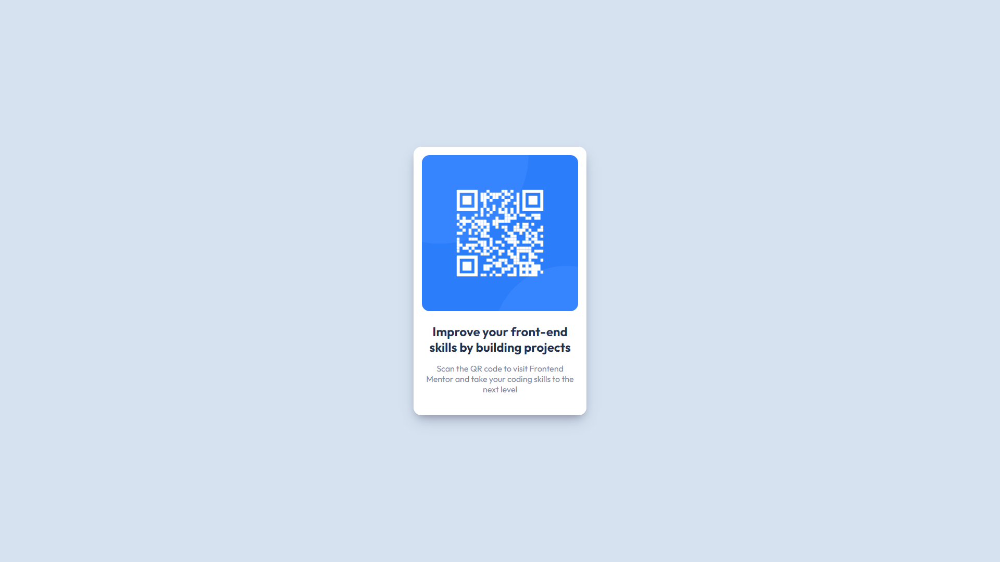

# Frontend Mentor - QR code component solution

This is a solution to the [QR code component challenge on Frontend Mentor](https://www.frontendmentor.io/challenges/qr-code-component-iux_sIO_H). Frontend Mentor challenges help you improve your coding skills by building realistic projects. 

## Table of contents

- [Overview](#overview)
  - [Screenshots](#screenshots)
- [My process](#my-process)
  - [Built with](#built-with)
- [Author](#author)

## Overview

### Screenshots

## My process

### Built with

- Semantic HTML5 markup
- CSS Flexbox

### Continued development

Me gustaría seguir enfocándome en la creación de layouts mas responsivos, sumado a una organización de elementos mas homogénea.

## Author

- Frontend Mentor - [@FelipeS02](https://www.frontendmentor.io/profile/FelipeS02)
- Linked-in - [Mi Linkedin](https://www.linkedin.com/in/felipe-saracho/)

